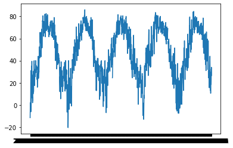

# weatherboard

Weatherboard is a web application that queries the OpenWeatherMap API to supply users with real-time global weather data. Users can follow locations to receive real-time weather data and forecasts, as well as historical statistics. Weatherboard offers a highly streamlined interface that allows users to keep up with the weather data that matters to them.

### Prerequisites

Install the ImageMagick distribution to your PC (neccessary for our backend image processing)

- Follow instructions here: https://imagemagick.org/script/download.php
- During installation, **make sure to check off "Install legacy utilities"** in the "Select Additional Tasks" page

Install Redis (https://redis.io/docs/getting-started/) and start a server locally

Optionally, substitute in your own API key

- Register for your own OpenWeatherMap One Call API key [here](https://openweathermap.org/api)
- Put the API key in the API_KEY variable [here](./server/.env)

### How to start the flask server

If you have python, pip, and pipenv installed already skip down to steps to run. Otherwise use the pre-steps.

pre-steps:

1. install python >= 3.10, check which verision using `python --version`
2. check if pip installed with: `python -m pip --version` or `pip --version` if not installed use: https://pip.pypa.io/en/stable/installation/
3. check if pipenv is installed `pipenv --version` if not installed https://pipenv-fork.readthedocs.io/en/latest/install.html

steps to run:

1. cd into the flask server direction
2. run `pipenv install` (install dependencies)
3. run `pipenv shell` (activate virtual env)
4. run `pip install --upgrade plotly`
5. to start the server first make the ./run.sh file executable by running `chmod +x run.sh` in terminal (mac) and then run `./run.sh` to start the server, server is on: http://127.0.0.1:8000/ . Alternatively you can run `gunicorn my_app.wsgi:app` to start the server.

- on windows:
  install waitress: `python -m pipenv install waitress`

instead of pipenv install/shell use: `python -m pipenv install` and then `python -m pipenv shell` and then run ```waitress-serve --listen=\*.8000 my_app.wsgi:app``` and then the server will be at 127.0.0.1:8000/<city>/<periods>

To run jupyter notebooks (to see model nb):

- Not necessary to run application, but model would be trained on monthly basis through these notebooks

* prestep: install jupyter nb https://jupyter.org/install
* cd into flask_server folder and run: jupyter notebook

### Weather Prediction Service

The weather prediction service runs off a flask server using facebook prophet time series prediction engine. Prediction limits are 30 days from current day, and data is re-trained each month to keep the forecast accurate/reduce model drift.

Historical weather data from Janurary 2018 was used to train the weather prediction model as seen in the screen shot below of Austin TX weather data:


